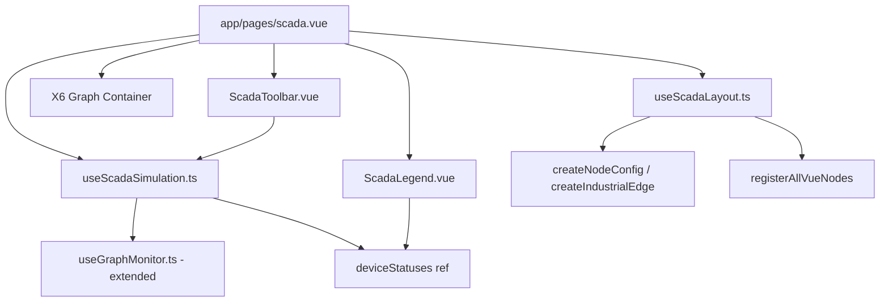
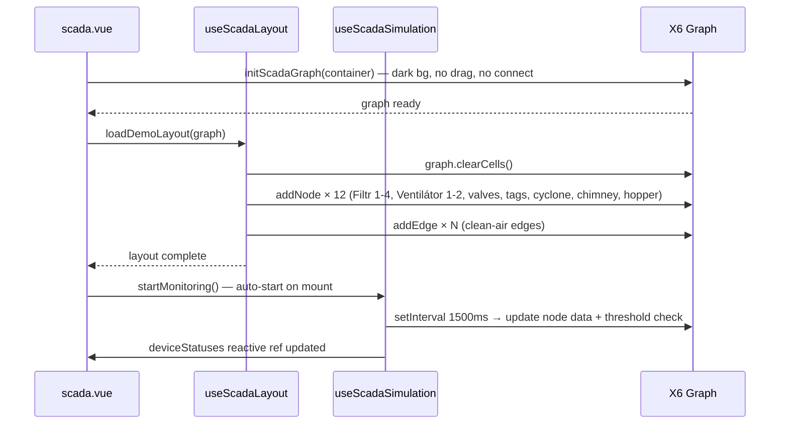

# Design: Màn hình SCADA ESP Hoàn chỉnh (esp-scada-screen)

## Overview

Tính năng này xây dựng một màn hình SCADA công nghiệp hoàn chỉnh mô phỏng hệ thống lọc bụi tĩnh điện (ESP) hai tầng kiểu "Odprášení". Màn hình được triển khai như một Nuxt page riêng biệt (`/scada`) sử dụng AntV X6 ở chế độ read-only với bố cục P&ID cố định, simulation dữ liệu realtime, và các component UI chuyên dụng (toolbar, legend).

Thiết kế tái sử dụng toàn bộ node component và utility hiện có (`registerAllVueNodes`, `createNodeConfig`, `createIndustrialEdge`, `useGraphMonitor`) và bổ sung ba thành phần mới: composable `useScadaLayout`, composable `useScadaSimulation`, component `ScadaToolbar`, và component `ScadaLegend`.

### Quyết định thiết kế chính

- **Trang riêng biệt thay vì toggle mode**: Route `/scada` riêng biệt giúp URL bookmarkable, tránh state phức tạp khi chuyển đổi giữa design mode và SCADA mode.
- **Composable tách biệt cho layout và simulation**: `useScadaLayout` chỉ lo tọa độ/cấu trúc P&ID; `useScadaSimulation` mở rộng `useGraphMonitor` với threshold detection. Tách biệt này giúp test từng phần độc lập.
- **X6 graph instance riêng cho SCADA**: Không chia sẻ `graphInstance` singleton với trang thiết kế. SCADA page tạo graph riêng với config khác (no dragging, no edge creation, dark background).
- **Reactive legend qua shared ref**: `useScadaSimulation` expose một `deviceStatuses` ref mà `ScadaLegend` watch trực tiếp, tránh polling hay event bus.

---

## Architecture



### Luồng khởi tạo



---

## Components and Interfaces

### 1. `app/pages/scada.vue`

Trang SCADA chính. Không có AppSidebar. Sử dụng layout `default` nhưng ẩn sidebar bằng cách không import `AppSidebar`.

```typescript
// Template structure
<template>
  <div class="scada-root" style="background: #0a0e1a; width: 100vw; height: 100vh; overflow: hidden; display: flex; flex-direction: column;">
    <ScadaToolbar :is-monitoring="isMonitoring" @start="startMonitoring" @stop="stopMonitoring" />
    <div class="flex-1 relative" ref="graphContainerRef">
      <TeleportContainer />
    </div>
    <ScadaLegend :device-statuses="deviceStatuses" />
  </div>
</template>
```

**Lifecycle:**

- `onMounted`: gọi `initScadaGraph(container)` → `loadDemoLayout(graph)` → `startMonitoring()`
- `onBeforeUnmount`: gọi `stopMonitoring()`, dispose graph

**Nuxt config**: Trang này dùng layout `false` (no default layout) để tránh render AppSidebar từ `app.vue`.

---

### 2. `app/composables/useScadaLayout.ts`

Composable thuần túy (không có reactive state) cung cấp hàm `loadDemoLayout(graph)`.

```typescript
export interface ScadaNodeDef {
  id: string;
  type: string; // shape name
  x: number;
  y: number;
  data: Record<string, any>;
}

export interface ScadaEdgeDef {
  source: { cell: string; port: string };
  target: { cell: string; port: string };
  edgeType: "clean-air" | "gas" | "signal";
}

export function useScadaLayout() {
  function loadDemoLayout(graph: Graph): void;
  return { loadDemoLayout };
}
```

**Tọa độ P&ID cố định** (canvas 1600×900, origin top-left):

| Node                | ID          | x    | y   | w   | h   |
| ------------------- | ----------- | ---- | --- | --- | --- |
| Filtr 1             | `filtr-1`   | 300  | 80  | 100 | 140 |
| Filtr 2             | `filtr-2`   | 450  | 80  | 100 | 140 |
| Filtr 3             | `filtr-3`   | 600  | 80  | 100 | 140 |
| Filtr 4             | `filtr-4`   | 750  | 80  | 100 | 140 |
| Hopper (water tank) | `hopper-1`  | 920  | 80  | 80  | 120 |
| Cyclone             | `cyclone-1` | 80   | 380 | 80  | 120 |
| Ventilátor 1        | `vent-1`    | 280  | 360 | 140 | 140 |
| Ventilátor 2        | `vent-2`    | 500  | 360 | 140 | 140 |
| Control Valve 1     | `valve-1`   | 200  | 390 | 80  | 80  |
| Control Valve 2     | `valve-2`   | 420  | 390 | 80  | 80  |
| Data Tag (Temp)     | `tag-temp`  | 680  | 370 | 120 | 60  |
| Data Tag (Pressure) | `tag-pres`  | 680  | 450 | 120 | 60  |
| Chimney             | `chimney-1` | 1100 | 200 | 60  | 160 |

**Stage labels** được thêm như X6 `rect` node với `shape: 'rect'`, không có ports, không draggable, chỉ hiển thị text.

---

### 3. `app/composables/useScadaSimulation.ts`

Mở rộng logic của `useGraphMonitor` với threshold detection và `deviceStatuses` reactive ref.

```typescript
export interface DeviceStatus {
  id: string;
  label: string; // "Filtr 1", "Ventilátor 1", ...
  status: "running" | "stopped" | "fault" | "chạy" | "dừng" | "lỗi";
}

export function useScadaSimulation(getGraph: () => Graph | null) {
  const isMonitoring = ref(false);
  const deviceStatuses = ref<DeviceStatus[]>([
    { id: "filtr-1", label: "Filtr 1", status: "dừng" },
    { id: "filtr-2", label: "Filtr 2", status: "dừng" },
    { id: "filtr-3", label: "Filtr 3", status: "dừng" },
    { id: "filtr-4", label: "Filtr 4", status: "dừng" },
    { id: "vent-1", label: "Ventilátor 1", status: "stopped" },
    { id: "vent-2", label: "Ventilátor 2", status: "stopped" },
  ]);

  function startMonitoring(): void;
  function stopMonitoring(): void;

  return { isMonitoring, deviceStatuses, startMonitoring, stopMonitoring };
}
```

**Threshold logic** (chạy trong mỗi tick của setInterval):

```typescript
// esp-filter-tank
const newVoltage = clamp(data.voltage + (Math.random() - 0.5) * 4, 40, 120);
const newCurrent = clamp(data.current + (Math.random() - 0.5) * 100, 0, 1200);
const newStatus = newVoltage < 60 || newVoltage > 90 ? "lỗi" : "chạy";
node.setData({ voltage: newVoltage, current: newCurrent, status: newStatus });

// motor-blower
const newStatorTemp = clamp(
  data.statorTemp + (Math.random() - 0.5) * 6,
  0,
  200,
);
const newStatus = newStatorTemp > 85 ? "fault" : "running";
node.setData({ statorTemp: newStatorTemp, status: newStatus });
```

Sau mỗi tick, `deviceStatuses` được cập nhật bằng cách đọc lại `node.getData().status` cho 6 thiết bị được theo dõi.

**Error resilience**: Mỗi node update được bọc trong `try/catch`; nếu lỗi, bỏ qua node đó và tiếp tục.

---

### 4. `app/components/ScadaToolbar.vue`

```typescript
// Props
defineProps<{
  isMonitoring: boolean;
}>();

// Emits
defineEmits<{
  start: [];
  stop: [];
}>();
```

**Template structure:**

- Container: `height: 48px`, `background: #1a1f2e`, `display: flex`, `align-items: center`
- Trái: Status Badge (`AUTO` xanh lá `#22c55e` / `STOP` đỏ `#ef4444`)
- Giữa: 11 nút theo thứ tự: Uživatel, Alarmy, Eventy, Info, **Stop**, **AutoPanel**, Obrazy, Další, Trendy, Alarm, Jazyk
- Phải: Realtime Clock (`DD.MM.YYYY HH:MM:SS`)

**Clock logic:**

```typescript
const now = ref(new Date());
let clockInterval: ReturnType<typeof setInterval>;

onMounted(() => {
  clockInterval = setInterval(() => {
    now.value = new Date();
  }, 1000);
});
onBeforeUnmount(() => clearInterval(clockInterval));

const formattedClock = computed(() => {
  const d = now.value;
  const pad = (n: number) => String(n).padStart(2, "0");
  return `${pad(d.getDate())}.${pad(d.getMonth() + 1)}.${d.getFullYear()} ${pad(d.getHours())}:${pad(d.getMinutes())}:${pad(d.getSeconds())}`;
});
```

---

### 5. `app/components/ScadaLegend.vue`

```typescript
defineProps<{
  deviceStatuses: DeviceStatus[];
}>();
```

**Template structure:**

- Container: `position: fixed`, `bottom: 16px`, `right: 16px`, `background: rgba(10,14,26,0.85)`, `border: 1px solid rgba(255,255,255,0.1)`, `border-radius: 8px`, `padding: 12px`
- Tiêu đề: "Stav zařízení" (trạng thái thiết bị — tiếng Czech)
- Mỗi thiết bị: đèn tròn màu + tên Czech
  - `running` / `chạy` → `#22c55e` (xanh lá)
  - `stopped` / `dừng` → `#64748b` (xám)
  - `fault` / `lỗi` → `#ef4444` + `animate-pulse` (đỏ nhấp nháy)

---

### 6. X6 Graph Configuration cho SCADA mode

```typescript
function initScadaGraph(container: HTMLElement): Graph {
  registerAllVueNodes(); // gọi 1 lần, idempotent

  return new Graph({
    container,
    autoResize: true,
    grid: { visible: false },
    background: { color: "#0a0e1a" },
    // Tắt hoàn toàn tương tác người dùng
    interacting: false,
    // Tắt panning và mousewheel zoom
    panning: { enabled: false },
    mousewheel: { enabled: false },
    // Tắt kết nối edge
    connecting: { enabled: false },
    // Tắt selection
    selecting: { enabled: false },
    // Tắt context menu
    contextmenu: { enabled: false },
  });
}
```

**Lưu ý**: `interacting: false` là cách X6 v2 disable toàn bộ node dragging và edge creation trong một lần. Không cần set từng option riêng lẻ.

---

## Data Models

### NodeData — esp-filter-tank

```typescript
interface FilterTankData {
  label: string; // "Filtr 1" | "Filtr 2" | "Filtr 3" | "Filtr 4"
  status: "chạy" | "dừng" | "lỗi";
  voltage: number; // kV, range [40, 120], normal [60, 90]
  current: number; // mA, range [0, 1200], normal ~600
}
```

### NodeData — motor-blower

```typescript
interface MotorBlowerData {
  label: string; // "Ventilátor 1" | "Ventilátor 2"
  status: "running" | "stopped" | "fault";
  current: number; // A, range [0, 500], normal ~120
  statorTemp: number; // °C, range [0, 200], fault threshold: 85
  bearingTemp: number; // °C, range [0, 150]
  size: "large";
}
```

### NodeData — control-valve

```typescript
interface ControlValveData {
  label: string; // "Van 1" | "Van 2"
  mode: "AUTO" | "MANUAL";
  openPercent: number; // [0, 100]
}
```

### NodeData — data-tag

```typescript
interface DataTagData {
  label: string; // "TEMP-01" | "PRES-01"
  value: number;
  unit: string; // "°C" | "kPa" | "A"
  status: "normal" | "warning" | "alarm";
}
```

### NodeData — static-equipment

```typescript
interface StaticEquipmentData {
  equipmentType: "cyclone" | "chimney" | "hopper";
  label: string;
}
```

### EdgeData

```typescript
interface IndustrialEdgeData {
  edgeType: "gas" | "clean-air" | "signal";
  flowActive: boolean;
}
```

### DeviceStatus (Legend)

```typescript
interface DeviceStatus {
  id: string;
  label: string;
  status: "running" | "stopped" | "fault" | "chạy" | "dừng" | "lỗi";
}
```

---

## Correctness Properties

_A property is a characteristic or behavior that should hold true across all valid executions of a system — essentially, a formal statement about what the system should do. Properties serve as the bridge between human-readable specifications and machine-verifiable correctness guarantees._

### Property 1: Clock format is always valid

_For any_ `Date` object passed to the clock formatting function, the resulting string must match the pattern `DD.MM.YYYY HH:MM:SS` — i.e., two-digit day, two-digit month, four-digit year, two-digit hours, two-digit minutes, two-digit seconds, separated by `.` and `:`.

**Validates: Requirements 2.5**

---

### Property 2: Clock values are monotonically non-decreasing

_For any_ sequence of N consecutive clock readings taken at 1-second intervals, each reading must be greater than or equal to the previous reading (time does not go backwards).

**Validates: Requirements 2.7, PROP-01**

---

### Property 3: Demo layout is idempotent

_For any_ number of consecutive calls to `loadDemoLayout(graph)` (N ≥ 1), the total node count and edge count after each call must be identical to the count after the first call.

**Validates: Requirements 3.6, PROP-03**

---

### Property 4: Simulation data stays within physical bounds

_For any_ number of simulation ticks (up to 100), the voltage of every `esp-filter-tank` node must remain within `[40, 120]` kV and the current must remain within `[0, 1200]` mA; the `statorTemp` of every `motor-blower` node must remain within `[0, 200]` °C and current within `[0, 500]` A.

**Validates: Requirements 4.2, 5.2, PROP-02**

---

### Property 5: Voltage threshold triggers fault status

_For any_ voltage value outside the range `[60, 90]` kV applied to an `esp-filter-tank` node, the simulation engine must set that node's status to `'lỗi'`. Conversely, _for any_ voltage value within `[60, 90]` kV, the status must not be `'lỗi'` (assuming no other fault condition).

**Validates: Requirements 4.4, 8.5**

---

### Property 6: Temperature threshold triggers fault status

_For any_ `statorTemp` value greater than `85°C` applied to a `motor-blower` node, the simulation engine must set that node's status to `'fault'`. Conversely, _for any_ `statorTemp` ≤ `85°C`, the status must not be `'fault'` (assuming no other fault condition).

**Validates: Requirements 5.5, 8.5**

---

### Property 7: Status badge is always consistent with simulation state

_For any_ sequence of start/stop toggles of the Simulation_Engine (up to 20 toggles), the Status_Badge must always display `'AUTO'` when `isMonitoring` is `true` and `'STOP'` when `isMonitoring` is `false`.

**Validates: Requirements 2.3, 2.4, 2.6, PROP-04**

---

### Property 8: Device legend colors always match node statuses

_For any_ combination of statuses (`running`/`stopped`/`fault`/`chạy`/`dừng`/`lỗi`) assigned to the 6 tracked devices, the `ScadaLegend` component must render each device's indicator with the correct color: green for running/chạy, gray for stopped/dừng, red with animate-pulse for fault/lỗi.

**Validates: Requirements 7.3, 7.4, PROP-05**

---

**Property Reflection:**

- Properties 5 and 6 are distinct (different nodes, different thresholds, different status values) — no redundancy.
- Property 4 (bounds) and Properties 5/6 (thresholds) are complementary: bounds ensure values don't escape physical reality; thresholds ensure correct status transitions within that reality.
- Properties 2 (monotonicity) and 1 (format) are independent — format doesn't imply monotonicity.
- Property 3 (idempotence) is unique — not implied by any other property.
- Properties 7 and 8 are independent — badge reflects engine state; legend reflects node data.

---

## Error Handling

### Simulation tick errors

Each node update in the simulation interval is wrapped in `try/catch`:

```typescript
nodes.forEach((node) => {
  try {
    updateNode(node);
  } catch (err) {
    console.warn(`[ScadaSimulation] Skipping node ${node.id}:`, err);
  }
});
```

This satisfies Requirement 8.6 — a single bad node does not halt the simulation.

### Graph initialization failure

If `initScadaGraph` fails (e.g., container not mounted), the error is caught and a user-visible error state is shown instead of a blank screen.

### Component unmount cleanup

`useScadaSimulation` and `ScadaToolbar` both call `clearInterval` in `onBeforeUnmount`. The X6 graph is disposed via `graph.dispose()` in `scada.vue`'s `onBeforeUnmount`. This prevents memory leaks from dangling intervals and X6 event listeners (Requirement 10.3).

### Clock interval

The clock interval in `ScadaToolbar` is cleared in `onBeforeUnmount`. If the component is unmounted while the interval is pending, no stale update occurs.

---

## Testing Strategy

### Unit Tests (example-based)

Focus on specific behaviors with concrete inputs:

- `ScadaToolbar`: renders 11 buttons in correct order; Stop button emits `stop`; AutoPanel button emits `start`; Status Badge shows correct color for each state.
- `ScadaLegend`: renders 6 device entries with Czech names; fault status applies `animate-pulse`; all status-to-color mappings are correct.
- `useScadaLayout.loadDemoLayout`: creates correct node count (13 nodes); creates correct edge count; all Filtr nodes have correct default voltage/current; all Ventilátor nodes have correct default statorTemp; chimney node exists; cyclone node exists.
- `useScadaSimulation`: `startMonitoring` sets all Filtr to `chạy` and all Ventilátor to `running`; `stopMonitoring` sets all Filtr to `dừng` and all Ventilátor to `stopped`; error in one node update does not stop others.
- `scada.vue`: AppSidebar is not rendered; graph container is present; `loadDemoLayout` is called on mount.

### Property-Based Tests

Using **fast-check** (already available in the JS ecosystem, compatible with Vitest).

Each property test runs a minimum of **100 iterations**.

Tag format: `// Feature: esp-scada-screen, Property N: <property_text>`

**Property 1 — Clock format:**

```typescript
// Feature: esp-scada-screen, Property 1: Clock format is always valid
fc.assert(
  fc.property(
    fc.date({ min: new Date("2000-01-01"), max: new Date("2099-12-31") }),
    (date) => {
      const result = formatClock(date);
      return /^\d{2}\.\d{2}\.\d{4} \d{2}:\d{2}:\d{2}$/.test(result);
    },
  ),
  { numRuns: 100 },
);
```

**Property 2 — Clock monotonicity:**

```typescript
// Feature: esp-scada-screen, Property 2: Clock values are monotonically non-decreasing
// Use fake timers to advance 10 × 1000ms, record timestamps, verify t[i+1] >= t[i]
```

**Property 3 — Layout idempotence:**

```typescript
// Feature: esp-scada-screen, Property 3: Demo layout is idempotent
fc.assert(
  fc.property(fc.integer({ min: 1, max: 5 }), (n) => {
    const graph = createMockGraph();
    for (let i = 0; i < n; i++) loadDemoLayout(graph);
    return (
      graph.getNodes().length === EXPECTED_NODE_COUNT &&
      graph.getEdges().length === EXPECTED_EDGE_COUNT
    );
  }),
  { numRuns: 100 },
);
```

**Property 4 — Simulation data bounds:**

```typescript
// Feature: esp-scada-screen, Property 4: Simulation data stays within physical bounds
// Run simulation 100 ticks with fake timers, collect all node data snapshots,
// assert voltage in [40,120], current in [0,1200], statorTemp in [0,200]
```

**Property 5 — Voltage threshold:**

```typescript
// Feature: esp-scada-screen, Property 5: Voltage threshold triggers fault status
fc.assert(
  fc.property(
    fc.oneof(
      fc.float({ min: 40, max: 59.99 }), // below threshold
      fc.float({ min: 90.01, max: 120 }), // above threshold
    ),
    (voltage) => {
      const status = computeFilterStatus(voltage);
      return status === "lỗi";
    },
  ),
  { numRuns: 100 },
);
```

**Property 6 — Temperature threshold:**

```typescript
// Feature: esp-scada-screen, Property 6: Temperature threshold triggers fault status
fc.assert(
  fc.property(fc.float({ min: 85.01, max: 200 }), (statorTemp) => {
    const status = computeBlowerStatus(statorTemp);
    return status === "fault";
  }),
  { numRuns: 100 },
);
```

**Property 7 — Status badge consistency:**

```typescript
// Feature: esp-scada-screen, Property 7: Status badge is always consistent with simulation state
fc.assert(
  fc.property(
    fc.array(fc.boolean(), { minLength: 1, maxLength: 20 }),
    (toggleSequence) => {
      // Apply toggle sequence, verify badge always matches isMonitoring
    },
  ),
  { numRuns: 100 },
);
```

**Property 8 — Legend color mapping:**

```typescript
// Feature: esp-scada-screen, Property 8: Device legend colors always match node statuses
const statusArb = fc.constantFrom(
  "running",
  "stopped",
  "fault",
  "chạy",
  "dừng",
  "lỗi",
);
fc.assert(
  fc.property(
    fc.array(statusArb, { minLength: 6, maxLength: 6 }),
    (statuses) => {
      // Mount ScadaLegend with these statuses, verify each indicator color matches mapping
    },
  ),
  { numRuns: 100 },
);
```

### Integration Tests

- Full page mount: verify graph renders within 2 seconds.
- Simulation start/stop cycle: verify flow-active class added/removed on edges.
- Navigation: verify `/scada` route resolves to `scada.vue`; verify back-link navigates to `/`.
