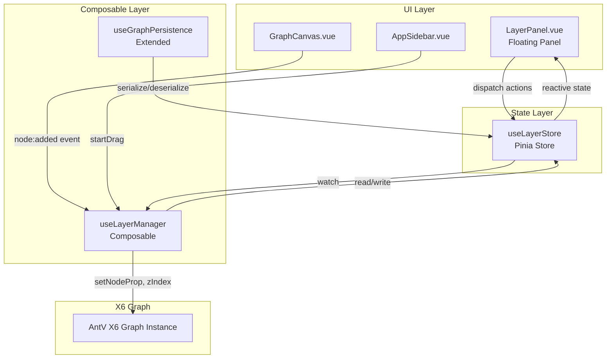

# Design Document: SCADA Layer Management

## Overview

Tính năng Layer Management bổ sung hệ thống tổ chức layer cho SCADA canvas, tương tự Photoshop/Figma. Người dùng có thể tạo nhiều layer, ẩn/hiện, khóa, sắp xếp z-order và gán node vào layer cụ thể. Toàn bộ layer data được lưu cùng graph data trong localStorage và file JSON.

Thiết kế tập trung vào ba nguyên tắc:

1. **Non-invasive integration** — Layer system được thêm vào mà không phá vỡ logic hiện tại của `useX6Graph`, `useGraphPersistence`, hay các node component.
2. **Single source of truth** — Pinia store (`useLayerStore`) là nơi duy nhất lưu trạng thái layer; canvas chỉ phản ánh store.
3. **Backward compatibility** — Graph data cũ (không có layer) vẫn load được bình thường.

## Architecture



Luồng dữ liệu chính:

- **Thêm node**: `AppSidebar` → `Dnd drop` → X6 `node:added` event → `useLayerManager.assignNodeToActiveLayer()` → `useLayerStore`
- **Toggle visibility**: `LayerPanel` → `useLayerStore.setVisible()` → watcher trong `useLayerManager` → X6 `node.setVisible()` / `node.setAttr('body/pointerEvents')`
- **Save/Load**: `useGraphPersistence` đọc `useLayerStore.exportLayerData()` → merge vào JSON → khi load gọi `useLayerStore.importLayerData()`

## Components and Interfaces

### 1. `useLayerStore` (Pinia Store)

Store trung tâm, không phụ thuộc vào X6.

```typescript
interface Layer {
  id: string; // UUID
  name: string; // "Layer 1", "Layer 2", ...
  color: string; // hex color từ palette
  visible: boolean;
  locked: boolean;
  order: number; // z-order index, cao hơn = hiển thị trên
}

interface LayerState {
  layers: Layer[];
  activeLayerId: string;
  nodeLayerMap: Record<string, string>; // nodeId → layerId
}
```

Actions:

- `initDefault()` — tạo layer mặc định "Layer 1"
- `addLayer()` — thêm layer mới với tên auto-increment
- `renameLayer(id, name)` — đổi tên layer
- `deleteLayer(id)` — xóa layer (trả về `{ ok, error?, movedNodeIds? }`)
- `setVisible(id, visible)` — toggle visibility
- `setLocked(id, locked)` — toggle lock
- `setColor(id, color)` — gán màu
- `setActiveLayer(id)` — đặt active layer
- `reorderLayers(fromIndex, toIndex)` — kéo thả sắp xếp
- `assignNode(nodeId, layerId)` — gán node vào layer
- `assignNodes(nodeIds, layerId)` — gán nhiều node
- `getLayerOfNode(nodeId)` — trả về layerId của node
- `exportLayerData()` — serialize để lưu
- `importLayerData(data)` — restore từ saved data

### 2. `useLayerManager` (Composable)

Cầu nối giữa `useLayerStore` và X6 Graph instance. Xử lý side effects lên canvas.

```typescript
export const useLayerManager = (getGraph: () => Graph | null) => {
  // Watchers
  watch(layers, applyVisibilityToCanvas);
  watch(layers, applyZOrderToCanvas);
  watch(layers, applyLockToCanvas);

  // Event handlers
  function onNodeAdded(node: Node): void;
  function onNodeDropped(node: Node): boolean; // false nếu active layer locked/hidden

  // Canvas sync
  function applyVisibilityToCanvas(): void;
  function applyZOrderToCanvas(): void;
  function applyLockToCanvas(): void;

  return { onNodeAdded, onNodeDropped };
};
```

### 3. `LayerPanel.vue` (Component)

Floating panel với drag-to-move. Sử dụng `useLayerStore` trực tiếp.

Props: không có (đọc store trực tiếp)

Template structure:

```
LayerPanel
├── Header (draggable handle + collapse button)
├── LayerList (v-for layers)
│   └── LayerRow
│       ├── ColorDot
│       ├── VisibilityToggle (eye icon)
│       ├── LockToggle (lock icon)
│       ├── LayerName (double-click to edit inline)
│       └── DeleteButton
└── AddLayerButton
```

Drag-to-move: sử dụng `mousedown` + `mousemove` + `mouseup` trên header, clamp vị trí trong viewport bounds.

Layer row drag-to-reorder: sử dụng HTML5 Drag and Drop API (`draggable`, `dragover`, `drop`).

### 4. `useGraphPersistence` (Extended)

Mở rộng composable hiện tại để inject/extract layer data:

```typescript
// Trong saveGraph():
const layerData = layerStore.exportLayerData();
const json = { ...graph.toJSON(), layers: layerData };

// Trong loadGraph():
const { layers, ...graphJson } = json;
graph.fromJSON(graphJson);
if (layers) layerStore.importLayerData(layers);
else layerStore.initDefault(); // backward compat
```

### 5. Context Menu (Right-click "Move to Layer")

Tích hợp vào `GraphCanvas.vue` thông qua X6 event `node:contextmenu`. Render một `<div>` absolute positioned với danh sách layer từ store.

## Data Models

### Layer Definition (lưu trong store và JSON)

```typescript
interface Layer {
  id: string; // "layer-uuid-xxxx"
  name: string; // "Layer 1"
  color: string; // "#ef4444" (từ LAYER_COLORS palette)
  visible: boolean; // true
  locked: boolean; // false
  order: number; // 0 = bottom, N = top
}
```

### Serialized Layer Data (trong JSON export)

```typescript
interface LayerExportData {
  layers: Layer[];
  nodeLayerMap: Record<string, string>; // { "node-id-1": "layer-id-1", ... }
  activeLayerId: string;
}
```

### Color Palette

```typescript
const LAYER_COLORS = [
  "#ef4444", // red
  "#f97316", // orange
  "#eab308", // yellow
  "#22c55e", // green
  "#06b6d4", // cyan
  "#3b82f6", // blue
  "#8b5cf6", // violet
  "#ec4899", // pink
];
```

### Merged Save Format (localStorage / JSON file)

```json
{
  "cells": [...],
  "layers": {
    "layers": [
      { "id": "layer-1", "name": "Layer 1", "color": "#3b82f6", "visible": true, "locked": false, "order": 0 }
    ],
    "nodeLayerMap": { "node-abc": "layer-1" },
    "activeLayerId": "layer-1"
  }
}
```

## Correctness Properties

_A property is a characteristic or behavior that should hold true across all valid executions of a system — essentially, a formal statement about what the system should do. Properties serve as the bridge between human-readable specifications and machine-verifiable correctness guarantees._

---

**Property Reflection (trước khi viết properties):**

Sau khi phân tích prework, các nhóm properties có thể hợp nhất:

- 2.1 (hide nodes) và 2.2 (show nodes) → hợp nhất thành một round-trip property về visibility
- 3.1 (lock=true) và 3.4 (lock=false) → hợp nhất thành round-trip property về lock
- 8.1, 8.2, 8.3, 8.4 → hợp nhất thành một round-trip serialization property
- 5.4 và 5.5 → hợp nhất thành một property về blocked active layer
- 1.5 và 1.6 → tách riêng vì logic khác nhau (empty vs non-empty layer)

---

### Property 1: Auto-increment layer name uniqueness

_For any_ list of existing layers, adding a new layer via `addLayer()` should produce a layer whose name does not already exist in the layer list.

**Validates: Requirements 1.2**

---

### Property 2: Layer rename updates name

_For any_ layer id in the store and any non-empty string as the new name, calling `renameLayer(id, newName)` should result in the layer with that id having `name === newName`.

**Validates: Requirements 1.4**

---

### Property 3: Deleting an empty layer removes it

_For any_ layer that has no entries in `nodeLayerMap`, calling `deleteLayer(id)` should remove that layer from the layers array, and the layers array length should decrease by one.

**Validates: Requirements 1.5**

---

### Property 4: Deleting a non-empty layer moves nodes to active layer

_For any_ layer containing one or more nodes (i.e., has entries in `nodeLayerMap`), after a confirmed deletion, all node ids that were previously mapped to that layer should now be mapped to the `activeLayerId`.

**Validates: Requirements 1.6**

---

### Property 5: At least one layer always exists (deletion invariant)

_For any_ store state with exactly one layer, calling `deleteLayer` on that layer should return an error result and the layers array should remain unchanged (still contain exactly one layer).

**Validates: Requirements 1.7**

---

### Property 6: Visibility round-trip

_For any_ layer, calling `setVisible(id, false)` then `setVisible(id, true)` should result in the layer having `visible === true` — restoring the original visible state.

**Validates: Requirements 2.1, 2.2**

---

### Property 7: Hidden layer blocks node interaction

_For any_ layer with `visible === false`, all nodes mapped to that layer should have their X6 interactivity disabled (i.e., `node.isVisible() === false` or pointer-events disabled).

**Validates: Requirements 2.3**

---

### Property 8: Lock round-trip

_For any_ layer, calling `setLocked(id, true)` then `setLocked(id, false)` should result in the layer having `locked === false`.

**Validates: Requirements 3.1, 3.4**

---

### Property 9: Locked layer does not block visibility toggle

_For any_ layer with `locked === true`, calling `setVisible(id, false)` should succeed and result in `visible === false` (lock state does not interfere with visibility).

**Validates: Requirements 3.5**

---

### Property 10: Layer reorder updates order correctly

_For any_ layer list of length N and any valid source index `i` and target index `j` (0 ≤ i, j < N, i ≠ j), calling `reorderLayers(i, j)` should result in the layer that was at index `i` now being at index `j` in the layers array.

**Validates: Requirements 4.1**

---

### Property 11: Z-order invariant after reorder

_For any_ layer ordering, after `applyZOrderToCanvas()` is called, all nodes belonging to the layer at array index `i` should have a higher z-index value than all nodes belonging to the layer at array index `i+1`.

**Validates: Requirements 4.2**

---

### Property 12: Exactly one active layer at all times

_For any_ sequence of operations (addLayer, deleteLayer, setActiveLayer, reorderLayers), the store should always have exactly one layer where `id === activeLayerId`, and `activeLayerId` should always reference an existing layer id.

**Validates: Requirements 5.1**

---

### Property 13: Node drop assigns to active layer

_For any_ node id added to the canvas and any active layer id, calling `assignNode(nodeId, activeLayerId)` (triggered by `node:added` event) should result in `nodeLayerMap[nodeId] === activeLayerId`.

**Validates: Requirements 5.3**

---

### Property 14: Blocked active layer prevents node assignment

_For any_ active layer that is either `locked === true` or `visible === false`, attempting to assign a new node to it should return a blocked result, and `nodeLayerMap` should not contain the new node id.

**Validates: Requirements 5.4, 5.5**

---

### Property 15: Bulk node reassignment

_For any_ set of node ids `S` and any target layer id `targetId`, calling `assignNodes(S, targetId)` should result in every node id in `S` having `nodeLayerMap[nodeId] === targetId`.

**Validates: Requirements 6.2**

---

### Property 16: Layer data serialization round-trip

_For any_ layer store state (any number of layers, any nodeLayerMap, any activeLayerId), calling `exportLayerData()` then `importLayerData(exported)` should produce a store state equivalent to the original (same layers array, same nodeLayerMap, same activeLayerId).

**Validates: Requirements 8.1, 8.2, 8.3, 8.4**

---

### Property 17: Layer row renders all required controls

_For any_ layer object, the rendered `LayerRow` component should contain a visibility toggle, a lock icon, a color label indicator, the layer name, and a delete button.

**Validates: Requirements 7.3**

---

## Error Handling

| Tình huống                              | Xử lý                                                                           |
| --------------------------------------- | ------------------------------------------------------------------------------- |
| Xóa layer duy nhất                      | `deleteLayer` trả về `{ ok: false, error: 'LAST_LAYER' }`, hiển thị toast error |
| Xóa layer có node                       | Hiển thị `<ConfirmDialog>`, nếu confirm thì move nodes rồi xóa                  |
| Thêm node vào active layer bị lock      | Trả về `{ ok: false, error: 'LAYER_LOCKED' }`, hiển thị warning toast           |
| Thêm node vào active layer bị ẩn        | Trả về `{ ok: false, error: 'LAYER_HIDDEN' }`, hiển thị warning toast           |
| Import JSON không có layer data         | `importLayerData(undefined)` → gọi `initDefault()`, không throw                 |
| Import JSON với layer data không hợp lệ | Validate schema, fallback về `initDefault()`, log warning                       |
| Rename thành tên rỗng                   | Validate trong action, reject nếu `name.trim() === ''`                          |

## Testing Strategy

### Dual Testing Approach

Tính năng này phù hợp với property-based testing vì:

- `useLayerStore` là pure state logic (không phụ thuộc DOM/X6)
- Nhiều invariants cần giữ đúng với mọi input (số lượng layer, node mapping, thứ tự)
- Input space lớn: bất kỳ tổ hợp layer nào, node nào, thứ tự nào

**PBT Library**: [fast-check](https://fast-check.io/) (đã có trong ecosystem Vitest/Nuxt)

### Unit Tests (example-based)

Tập trung vào:

- Khởi tạo default layer (Requirement 1.1)
- UI rendering: layer row có đủ controls (Requirement 7.3)
- Backward compat: import JSON không có layer data (Requirement 8.5, 8.6)
- Context menu xuất hiện khi right-click (Requirement 6.1)
- Visual indicator khi layer hidden/locked (Requirements 2.4, 3.3)

### Property-Based Tests

Mỗi property test chạy tối thiểu 100 iterations. Tag format: `Feature: scada-layer-management, Property {N}: {text}`

| Property                               | Arbitraries cần tạo                                                   |
| -------------------------------------- | --------------------------------------------------------------------- |
| P1: Auto-increment name uniqueness     | `fc.array(fc.string())` cho existing names                            |
| P2: Rename updates name                | `fc.uuid()` + `fc.string({ minLength: 1 })`                           |
| P3: Delete empty layer                 | `fc.record({ layers: fc.array(...), nodeLayerMap: fc.constant({}) })` |
| P4: Delete non-empty layer moves nodes | `fc.record({ layer với nodes })`                                      |
| P5: Last layer deletion rejected       | Store với đúng 1 layer                                                |
| P6: Visibility round-trip              | `fc.record({ id, visible: fc.boolean() })`                            |
| P7: Hidden layer blocks interaction    | Layer với `visible: false` + nodes                                    |
| P8: Lock round-trip                    | `fc.record({ id, locked: fc.boolean() })`                             |
| P9: Lock doesn't block visibility      | Layer với `locked: true`                                              |
| P10: Reorder correctness               | `fc.array(layer, { minLength: 2 })` + valid indices                   |
| P11: Z-order invariant                 | Layer list + node assignments                                         |
| P12: Exactly one active layer          | Sequence of random operations                                         |
| P13: Node drop → active layer          | `fc.uuid()` nodeId + any active layer                                 |
| P14: Blocked active layer              | Layer với locked/hidden + node add attempt                            |
| P15: Bulk reassignment                 | `fc.array(fc.uuid())` + target layer id                               |
| P16: Serialization round-trip          | Arbitrary full store state                                            |
| P17: Layer row renders controls        | Arbitrary `Layer` object                                              |

### Integration Tests

- `useLayerManager` + X6 Graph: verify visibility/lock/z-order được apply đúng lên canvas
- `useGraphPersistence` extended: save → reload → verify layer state khớp
- End-to-end: drag node → verify assigned to active layer trên canvas thực
